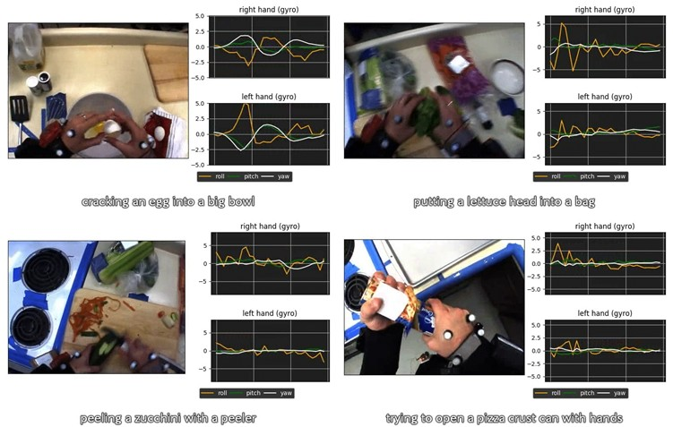

# Sensor-Augmented Egocentric-Video Captioning with Dynamic Modal Attention

by [Katsuyuki Nakamura](https://scholar.google.com/citations?user=ZIxQ5zAAAAAJ&hl=en), [Hiroki Ohashi](https://scholar.google.com/citations?user=GKC6bbYAAAAJ), and Mitsuhiro Okada.

This repository contains the dataset of the paper "[Sensor-Augmented Egocentric-Video Captioning with Dynamic Modal Attention](https://arxiv.org/abs/2109.02955)", which is accepted to ACMMM2021.


## MMAC Captions dataset

We provide a dataset called MMAC Captions for sensor-augmented egocentric-video captioning. The dataset contains 5,002 activity descriptions by extending the [CMU-MMAC dataset](http://kitchen.cs.cmu.edu/index.php). A number of activity description examples are shown as follows.
```
- Spreading tomato sauce on pizza crust with a spoon.
- Taking a fork, knife, and peeler from a drawer.
- Cutting a zucchini in half with a kitchen knife.
- Moving a paper plate slightly to the left.
- Stirring brownie batter with a fork.
```


We split the dataset into training, validation, and test sets, resulting in 2,923, 838, and 1,241 data for the training, validation, and test sets, respectively. Please see our paper for details.


## Usage


### Preparation

Make sure to download the [CMU-MMAC dataset](http://kitchen.cs.cmu.edu/main.php), and unzip them as follows. Wireless IMU data (**6DOFv4.zip**) and Wired IMU data (**3DMGX1.zip**) are required to perform the following pre-processing.

```
./data/cmu_sensor_data/
    S07_Brownie_3DMGX1/
        2794_01-30_16_30_49-time.txt
        2795_01-30_16_30_49-time.txt
        2796_01-30_16_30_49-time.txt
        3261_01-30_16_30_49-time.txt
        3337_01-30_16_30_49-time.txt
    S07_Brownie_6DOFv4/
        000666015711_01-30_16_30_30-time-synch.txt
        000666015715_01-30_16_30_30-time-synch.txt
        000666015735_01-30_16_30_30-time-synch.txt
        0006660160E3_01-30_16_30_30-time-synch.txt
    S07_Eggs_3DMGX1/
        2794_01-30_17_11_20-time.txt
        2795_01-30_17_11_20-time.txt
        2796_01-30_17_11_20-time.txt
        3261_01-30_17_11_20-time.txt
        3337_01-30_17_11_20-time.txt
    S07_Eggs_6DOFv4/
    ...
```


### Resampling the sensor data

To resample the sensor data into 30Hz, please run: 

```
$ cd sh; bash resampling_sensor_raw_data_default.sh
```

You can edit the output path settings in `./setting/setting_sensor_default.toml`.

### Synchronizing video and sensor data

To synchronize video and sensor data, please run:

```
$ cd sh; bash sensor_selected_timestamp_default.sh
```
This process will provide the sensor data of 63-dim sequences.

### Requirements

- Python 3.9.5
- numpy
- pandas
- toml


## Citation

Please consider citing our paper if it helps your research:
```
@inproceedings{nakamura2021sensoraugmented,
    title={Sensor-Augmented Egocentric-Video Captioning with Dynamic Modal Attention},
    author={Nakamura, Katsuyuki and Ohashi, Hiroki and Okada, Mitsuhiro},
    booktitle={ACM International Conference on Multimedia (MM)},
    year={2021},
}
```
## Acknowledgement

The CMU-MMAC data used in this paper was obtained from http://kitchen.cs.cmu.edu/ and the data collection was funded in part by the National Science Foundation under Grant No. EEEC-0540865.

## License 

This software is released under the MIT License, see [LICENSE.txt](LICENSE.txt).

If you have questions, please contact to mmac-captions@rdgml.intra.hitachi.co.jp

